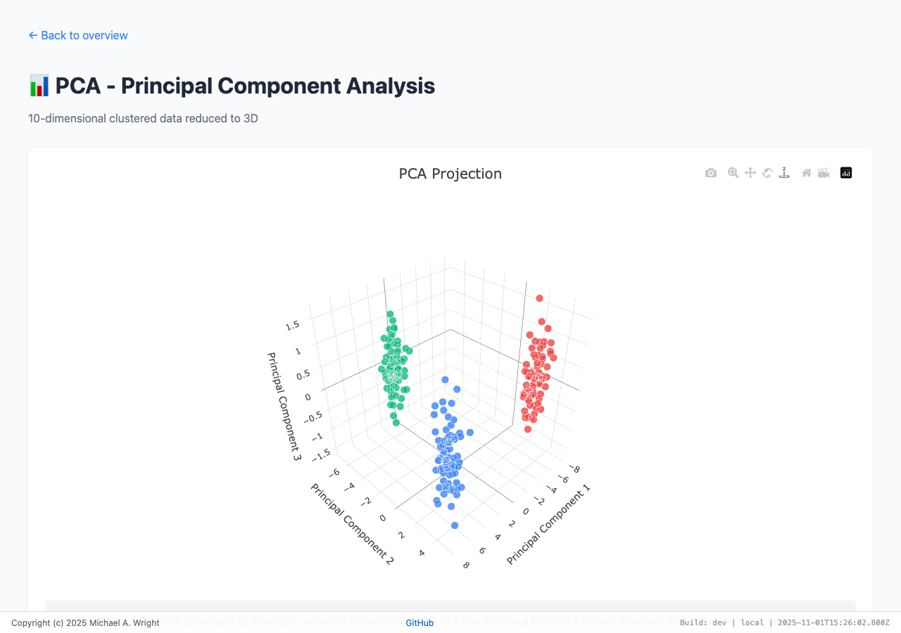

# Dimensionality Reduction Visualization Tool

Interactive 3D visualizations for dimensionality reduction techniques (PCA, LDA, Isomap) with support for real embedding analysis from multiple models.

> **Note:** The live demo includes all synthetic data visualizations (PCA, LDA, Isomap). However, Ollama-based local embedding features require running the project locally on a system with Ollama installed and the appropriate embedding model(s) downloaded (e.g., nomic-embed-text, granite-embedding).

**[Live Demo](https://wrightmikea.github.io/dimensionality-reduction/)**



## New Features for Real Embeddings

### Embedding Visualization
- Visualize high-dimensional embeddings (768d-3072d) in 3D
- Support for multiple embedding models (OpenAI, Voyage, Cohere)
- Query-based search with similarity highlighting
- Interactive hover text showing chunk content

### Model Comparison
- Side-by-side comparison of different embedding models
- Consistent color coding across models
- Easy identification of clustering differences
- Choose the best model for your specific use case

## Features

### Core Visualizations
- **PCA**: Principal Component Analysis - finds directions of maximum variance
- **LDA**: Linear Discriminant Analysis - maximizes class separation
- **Isomap**: Isometric Mapping - preserves manifold geodesic distances

### Real Embedding Analysis
- **Multiple Models**: OpenAI, Voyage AI, Cohere support
- **Query Search**: Highlight chunks similar to a search query
- **Model Comparison**: Side-by-side visualization
- **High Dimensions**: Efficiently handles 768d-3072d embeddings

## Getting Started

### First-Time Setup (Required for Fresh Clone)

```bash
# 1. Install dependencies
npm install

# 2. Build the project (transpiles src/ to dist/)
npm run build

# 3. Start the development server
npm run dev

# 4. Open http://localhost:4444 in your browser
```

**Important**: You must run `npm run build` after cloning the repository or the visualizations will fail with "pca is not defined" errors. The HTML files reference transpiled JavaScript in the `dist/` directory.

### Quick Start Options

#### Option 1: Try Ollama (Local, Private, No API Keys)
```bash
# 1. Start Ollama (in separate terminal)
ollama serve

# 2. Ensure you've completed the setup steps above, then:
# 3. Open http://localhost:4444/index_ollama.html
# 4. Select "The Mysterious Affair at Styles"
# 5. Click "Load & Chunk Text", then "Generate Embeddings"
```

#### Option 2: Try Cloud Models (Requires API Keys)
```bash
# Ensure you've completed the setup steps above, then:
# Open http://localhost:4444/index_embeddings.html
```

## Answering Your Questions

### Q: How to view actual embeddings using different models?

**A:** Use `index_embeddings.html`:
1. Paste your text chunks
2. Select embedding model from dropdown
3. Click "Generate Embeddings & Visualize"

Supports OpenAI (1536d/3072d), Voyage (1024d), Cohere (1024d), and custom models.

### Q: How to handle embeddings with many dimensions?

**A:** The algorithms already work with ANY dimension:
- 10D (demo data)
- 768D (BERT)
- 1536D (OpenAI small)
- 3072D (OpenAI large)

No code changes needed! Just pass in your embeddings.

### Q: How to show which chunk is closest to a query?

**A:** Use the Query Search feature:
1. Generate embeddings for your chunks
2. Enter search query: "machine learning algorithms"
3. Click "Highlight Similar Chunks"
4. **Result**: Red points = most similar, size = similarity strength

### Q: How to see different clustering with different embeddings?

**A:** Use `index_comparison.html`:
- Shows 2-4 models side-by-side
- Same chunks = same colors across all models
- Easily compare clustering patterns
- Identify which model works best for your data

## Usage Examples

### Example 1: Visualize OpenAI Embeddings
```javascript
// In index_embeddings.html
1. Paste chunks: "ML concepts", "nature descriptions", "code snippets"
2. Select: "OpenAI text-embedding-3-small (1536d)"
3. Choose: "PCA (fastest)"
4. Click: "Generate Embeddings & Visualize"
5. See: 3D plot with clear cluster separation
```

### Example 2: Find Similar Chunks
```javascript
// After generating embeddings
1. Query: "neural network training"
2. Top K: 10
3. Click: "Highlight Similar Chunks"
4. Result: Top 10 ML-related chunks highlighted in red
```

### Example 3: Compare Models
```javascript
// In index_comparison.html
1. Select: OpenAI Small, OpenAI Large, Voyage-2
2. Click: "Generate Comparison"
3. Observe: Which model best separates your content types
```

## File Structure

```
   index_embeddings.html      # Real embedding visualization
   index_comparison.html      # Model comparison
   src/
      shared.js               # Core PCA/LDA/Isomap algorithms
      embedding-manager.js    # Embedding utilities
   api/embed/                 # API endpoints for embeddings
      openai.js
      voyage.js
   example_data.json          # Sample data
   EMBEDDING_GUIDE.md         # Comprehensive guide
   USAGE_SUMMARY.md           # Quick answers
   README.md                  # This file
```

## Performance

| Dimensions | Points | PCA Time | Isomap Time |
|-----------|--------|----------|-------------|
| 10D       | 240    | ~10ms    | ~500ms      |
| 768D      | 240    | ~50ms    | ~2s         |
| 1536D     | 240    | ~100ms   | ~4s         |
| 3072D     | 240    | ~200ms   | ~8s         |

**Tip**: For very high dimensions, use 2-stage reduction:
```javascript
const mid = pca(embeddings3072D, 128);  // Fast pre-reduction
const final = isomap(mid, 3, 12);       // Quality final reduction
```

## Development Workflow

### Making Changes to JavaScript Files

If you modify any files in the `src/` directory:
```bash
# Rebuild to update dist/ directory
npm run build

# Or use the combined command
npm start  # Runs build + dev
```

The `dist/` directory is gitignored, so every clone needs to run `npm run build`.

### Project Structure
- `src/` - Source JavaScript files (edit these)
- `dist/` - Transpiled files (auto-generated, don't edit)
- HTML files reference scripts in `dist/`

## Deployment

### Serverless (Vercel - Recommended)
```bash
vercel deploy
vercel env add OPENAI_API_KEY
```

### Local Development
```bash
# Create .env with API keys
npm run dev
```

## Documentation

- **USAGE_SUMMARY.md**: Quick answers to your specific questions
- **EMBEDDING_GUIDE.md**: Detailed implementation guide
- **docs/research.md**: Background on dimensionality reduction

## Cost Optimization

1. **Cache embeddings**: Use localStorage or database
2. **Batch requests**: Process 100 chunks at once
3. **Start small**: Use 3-small before 3-large
4. **Monitor usage**: Track API costs

## Troubleshooting

- **"pca is not defined" error?** Run `npm run build` to create the `dist/` directory with transpiled JavaScript files
- **No plot?** Check console (F12), need at least 3 chunks
- **API errors?** Verify environment variables
- **Poor clustering?** Try different models or chunk sizes
- **Too slow?** Use PCA instead of Isomap
- **Fresh clone not working?** Make sure you ran all three setup commands: `npm install`, `npm run build`, `npm run dev`

## Next Steps

1. **Try demo mode**: No API required
2. **Deploy API endpoints**: Vercel or Netlify
3. **Test with your data**: Use example_data.json as template
4. **Compare models**: Find the best for your content

## License

MIT

---

Built with Claude Code
